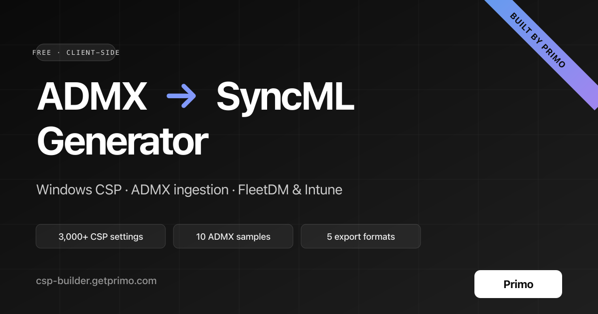

<div align="center">

# ADMX → SyncML Builder

**Free online generator to convert Windows ADMX/ADML templates and the Microsoft Policy CSP catalog into ready-to-ship SyncML payloads for FleetDM, Intune, and any MDM.**

[](https://csp-builder.getprimo.com?utm_source=github&utm_medium=readme&utm_campaign=csp_builder&utm_content=hero_badge)
[](https://www.getprimo.com?utm_source=github&utm_medium=readme&utm_campaign=csp_builder&utm_content=hero_badge)
[](./LICENSE)

[**🚀 Open the tool**](https://csp-builder.getprimo.com?utm_source=github&utm_medium=readme&utm_campaign=csp_builder&utm_content=hero_cta) · [**Built by Primo — Modern MDM →**](https://www.getprimo.com/product-page/mdm?utm_source=github&utm_medium=readme&utm_campaign=csp_builder&utm_content=hero_pitch)



</div>

---

## What this is

A **100% client-side** web app that turns Windows policy definitions into the OMA-DM / SyncML XML your MDM actually speaks. No backend, no upload, no tracking — open it and go.

**Two tracks, one UI:**

1. **ADMX-backed CSP** — drop your own ADMX/ADML templates (or pick from 10 pre-loaded: Chrome, Edge, Firefox, Office, OneDrive, Adobe…). The app parses them, filters CSP-ingestable policies (with a reason for each rejection), and emits `<Replace>` / `<Delete>` commands under `./Device/Vendor/MSFT/Policy/Config/{Area}~Policy~{Cat}/{Policy}`.
2. **Native Policy CSP** — browse the full Microsoft Policy CSP catalog (**3,000+ settings**, 260+ areas) bundled from the official DDFv2 Feb 2026 release. Each setting is editable with a format-aware input and emits a proper `<Replace>` with the right `<Format>` tag (bool / int / chr / xml / b64).

Shared features: unified searchable list, per-policy **Apply** toggle, Device/User scope for `Both`-class policies, **5 export modes** (FleetDM default + 4 SyncML-envelope variants), live XML preview, copy/download.

---

## 🎯 Why it exists

Going from on-prem **GPO** → **MDM-based policy delivery** means hand-writing SyncML. That's a lot of error-prone XML and a lot of hunting through Microsoft docs to find the right LocURI, format, and escape rules.

This tool does it for you in a browser tab — free, private, offline-capable.

**Keywords** (for the SEO crawlers and anyone searching here): _ADMX to SyncML, FleetDM ADMX, FleetDM CSP, Intune ADMX ingestion, Windows Policy CSP, Group Policy to MDM, OMA-DM, GPO converter, SyncML generator, Policy Configuration Service Provider._

---

## ⭐ Built by Primo

This tool is a free gift from the team at **[Primo](https://www.getprimo.com?utm_source=github&utm_medium=readme&utm_campaign=csp_builder&utm_content=primo_pitch)** — the modern IT platform for startups and growing companies.

Primo gives you:

- 🖥️ **MDM** — enroll & manage macOS, Windows, Linux, and iOS fleets from one console (ADMX-backed and native CSP policies supported out of the box, no SyncML hand-crafting needed)
- 🧑‍💼 **Onboarding & offboarding** — synced with your HRIS (Payfit, BambooHR, Personio, HiBob, etc.)
- 📦 **Global procurement** — order hardware in 60+ countries, track warranties, manage returns
- 💳 **SaaS management** — inventory your apps, manage licences, auto-deprovision leavers
- 🛡️ **Endpoint protection** — push CrowdStrike / SentinelOne / ThreatDown in one click

> If you're shipping these CSP policies manually because your current MDM can't ingest ADMX, or because you're stuck writing SyncML by hand — **[book a 15-min demo](https://www.getprimo.com/request-a-demo?utm_source=github&utm_medium=readme&utm_campaign=csp_builder&utm_content=body_cta)** and we'll show you how Primo does it for you.

[**Discover Primo →**](https://www.getprimo.com?utm_source=github&utm_medium=readme&utm_campaign=csp_builder&utm_content=discover) · [**Primo for MDM**](https://www.getprimo.com/product-page/mdm?utm_source=github&utm_medium=readme&utm_campaign=csp_builder&utm_content=mdm_page) · [**Pricing**](https://www.getprimo.com/pricing?utm_source=github&utm_medium=readme&utm_campaign=csp_builder&utm_content=pricing) · [**Book a demo**](https://www.getprimo.com/request-a-demo?utm_source=github&utm_medium=readme&utm_campaign=csp_builder&utm_content=book_demo)

---

## Quickstart (developers)

```bash
npm install
npm run dev              # http://localhost:5173
```

Production:

```bash
npm run build            # dist/
npm run preview
```

### Ship as a single HTML file

```bash
npm run build:singlefile
# → dist-singlefile/index.html (~8 MB, standalone — 10 ADMX + full CSP catalog inlined)
```

The singlefile inlines JS, CSS, favicon, **all sample ADMX**, and the **full Policy CSP catalog**. Opens via `file://`, can be emailed, dropped on a share, or hosted static. Runs fully offline.

### Regenerate the OG image

```bash
npm run build:og-image   # rsvg-convert scripts/og-image.svg → public/og-image.png
```

### Regenerate the CSP catalog

```bash
npm run build:csp-catalog
# Reads scripts/csp-ddf/DDFv2Feb2026.zip and writes
# src/lib/csp-native/catalog.json (~1.5 MB, committed)
```

**Stack:** React 19 · TypeScript · Vite · TailwindCSS 3 · shadcn-style components · fast-xml-parser · Zustand · react-dropzone · lucide-react · Radix primitives.

---

## Pre-filled ADMX samples

The **"Pre-filled samples"** button loads any combination of 10 ADMX bundles (official sources, UTF-8 normalised for `?raw` bundling):

| ID            | Vendor     | Source                                                                    |
|---------------|------------|---------------------------------------------------------------------------|
| `chrome`      | Google     | `dl.google.com/.../policy_templates.zip` (official)                       |
| `edge`        | Microsoft  | `edgeupdates.microsoft.com` — `MicrosoftEdgePolicyTemplates` CAB          |
| `edge-update` | Microsoft  | same CAB                                                                  |
| `firefox`     | Mozilla    | `github.com/mozilla/policy-templates` (official release asset)            |
| `onedrive`    | Microsoft  | `github.com/bastienperez/admx-onedrive` (community mirror)                |
| `acrobat-dc`  | Adobe      | `github.com/systmworks/Adobe-DC-ADMX` (community template)                |
| `reader-dc`   | Adobe      | `github.com/nsacyber/Windows-Secure-Host-Baseline`                        |
| `office`      | Microsoft  | `github.com/iothacker/Microsoft-Office-365-Business-Group-Policy-ADMX…`   |
| `word`        | Microsoft  | same repo (`word16-365`)                                                  |
| `outlook`     | Microsoft  | same repo (`outlk16-365`)                                                 |

With all samples selected, the app loads **≈ 4,000 ADMX policies** of which **≈ 2,400 pass the CSP filter**.

---

## Native Policy CSP catalog

- **Source:** [DDFv2 Feb 2026](https://learn.microsoft.com/en-us/windows/client-management/mdm/configuration-service-provider-ddf) — Microsoft's official zip of 313 XML definition files.
- **Build step:** `npm run build:csp-catalog` reads the zip, walks every area under `./Device/Vendor/MSFT/Policy/Config` and `./User/…`, merges same-path entries into a single `scope: "Both"` record, and writes `src/lib/csp-native/catalog.json` (~1.5 MB, committed so the regular build doesn't re-parse the DDF).
- **Coverage:** ~3,000 settings across 260+ areas — AboveLock, Authentication, BitLocker, Browser, DeviceLock, Experience, Privacy, Update, WindowsDefenderSecurityCenter, …
- **Value editors** are format-aware: enum → Select, bool → Switch, int → number (with DDF-declared min/max), chr → text, xml → monospace textarea, b64 → textarea.

---

## CSP compatibility rules (for ADMX)

A policy is **ingestable** iff all of the following hold:

- `class` is `Machine`, `User`, or `Both`.
- `key` starts with `Software\Policies\` (case-insensitive, `\` or `/`).
- Every `elements` entry uses a supported type (see table below).
- The policy exposes at least one storage mechanism: `valueName`, `enabledValue`/`disabledValue`, or at least one element.
- `text` elements must not be `expandable="true"`.

### Supported element types

| ADMX type      | UI rendering                        | CSP encoding (`<data value="…"/>`) |
|----------------|-------------------------------------|------------------------------------|
| `boolean`      | Switch                              | `0` / `1`                          |
| `decimal`      | Number input (min/max)              | integer as text                    |
| `longDecimal`  | Number input                        | integer as text                    |
| `text`         | Text input (maxLength)              | raw text                           |
| `multiText`    | Textarea (one value per line)       | lines joined by `\n`               |
| `enum`         | Select                              | **index** (0-based) of the item    |
| `list`         | Add-able key/value table            | entries joined by `\uF000`         |

### Rejected (with a reason shown in the UI)

- `expandableString` / `text expandable="true"` — require env-var expansion on the device, not transmitted through CSP.
- Policies whose registry key is outside `Software\Policies\` (preference tattooing, not CSP).
- Any `element` with a tag outside the table above.

### Machine / User scope

- `class="Machine"` → `./Device/Vendor/MSFT/Policy/Config/…` (HKLM).
- `class="User"` → `./User/Vendor/MSFT/Policy/Config/…` (HKCU).
- `class="Both"` → admin toggles Device ↔ User per policy. ADMX ingestion itself always happens under `./Device/…/ADMXInstall/…` (visible from both scopes on current Windows 10/11).

---

## Apply semantics

Every policy (ADMX and native CSP) has an **Apply** switch, off by default.

- Apply = off → **not emitted** in SyncML (all 5 export modes).
- Editing any setting (state, scope, element value, CSP value) flips Apply on automatically.
- Turning Apply off preserves values — flip it back on later without retyping.

---

## Export modes

| Preset                                    | Outer wrapper                        | Ingestion | Use case |
|-------------------------------------------|--------------------------------------|:---------:|----------|
| **FleetDM compatible** *(default)*        | none (bare top-level tags)           |    ✗      | FleetDM Windows MDM custom profile — ingest ADMX in a **separate** FleetDM profile |
| ADMX Ingestion + Full SyncML envelope     | `<SyncML>` + `<SyncHdr>` + `<SyncBody>` | ✓      | Classic DM session payload |
| ADMX Ingestion (SyncBody only)            | `<SyncBody>` + `<Final/>`            |    ✓      | When the caller injects its own `<SyncHdr>` |
| Full SyncML envelope (no ingestion)       | `<SyncML>` + `<SyncHdr>` + `<SyncBody>` | ✗      | Target already has the ADMX registered |
| SyncBody only (no ingestion)              | `<SyncBody>` + `<Final/>`            |    ✗      | Minimal policy fragment |

### Generated commands

**ADMX ingestion** (once per file with at least one applied policy):

```xml
<Replace>
  <CmdID>1</CmdID>
  <Item>
    <Target>
      <LocURI>./Device/Vendor/MSFT/Policy/ConfigOperations/ADMXInstall/{AppName}/Policy/{UniqueID}</LocURI>
    </Target>
    <Meta><Format xmlns="syncml:metinf">chr</Format></Meta>
    <Data><![CDATA[… raw ADMX …]]></Data>
  </Item>
</Replace>
```

**Policy application:**

```xml
<Replace>
  <CmdID>2</CmdID>
  <Item>
    <Target>
      <LocURI>./Device/Vendor/MSFT/Policy/Config/{AreaName}~Policy~{CategoryPath}/{PolicyName}</LocURI>
    </Target>
    <Meta><Format xmlns="syncml:metinf">chr</Format></Meta>
    <Data>&lt;enabled/&gt;&lt;data id="ElementId" value="123"/&gt;</Data>
  </Item>
</Replace>
```

- `Not Configured` → `<Delete>` instead of `<Replace>`.
- `Disabled` → `<Data>&lt;disabled/&gt;</Data>`.
- `Enabled` no elements → `<Data>&lt;enabled/&gt;</Data>`.
- `Enabled` with elements → `<enabled/>` followed by one `<data id=… value=…/>` per element, XML-escaped inside `<Data>`.

---

## Architecture

```
src/
├─ lib/
│  ├─ admx/                  # ADMX parser, types, CSP compatibility filter
│  ├─ csp/                   # ADMX-backed SyncML encoder + export modes
│  ├─ csp-native/            # Native Policy CSP catalog + encoder
│  ├─ samples.ts             # 10 pre-filled ADMX bundles (?raw imports)
│  └─ primo.ts               # Primo URL helper with UTM tracking
├─ store/useAdmxStore.ts     # Zustand — files + configured + configuredCsp
├─ components/
│  ├─ FileUploader.tsx
│  ├─ PolicyList.tsx         # unified ADMX + native CSP, searchable
│  ├─ PolicyEditor.tsx       # dispatches by admx::/csp:: key prefix
│  ├─ AdmxEditor.tsx
│  ├─ CspEditor.tsx
│  ├─ ExportPanel.tsx
│  ├─ PrimoRibbon.tsx        # corner banner → getprimo.com
│  └─ ui/                    # shadcn-style Button, Card, Switch, Select…
└─ App.tsx
```

The `lib/` layer is pure (no React) — `parser`, `compatibility`, `encoder`, `syncml`, `catalog` are all trivially unit-testable.

---

## Known limitations

- List elements use `U+F000` as separator (per MSFT docs); a few MDM pipelines expect a different serialization.
- Parser surfaces ADMX parse failures as a whole; no partial recovery.
- No value-level validation beyond format (e.g. URL validity, IP ranges).
- Policy CSP `xml` / `b64` formats are freeform textareas — no schema-aware editors.
- Only English ADML ship in samples; other locales not bundled.
- Standalone CSPs (BitLocker config, WiFi Profile, DeviceLock complex tree) are out of scope in v1 — they need per-CSP schemas/templates.

---

## Contributing

Issues and PRs welcome. If you rely on this tool in a production MDM pipeline, a quick ⭐ helps others find it on GitHub search.

## License

MIT. See [LICENSE](./LICENSE).

---

<div align="center">

### Need to ship GPO / CSP policies at scale?

This tool handles the _payload_. [**Primo**](https://www.getprimo.com/product-page/mdm?utm_source=github&utm_medium=readme&utm_campaign=csp_builder&utm_content=bottom_cta) handles the rest — MDM for macOS, Windows, Linux and iOS, onboarding, procurement, SaaS. All in one place.

[**→ See Primo for MDM**](https://www.getprimo.com/product-page/mdm?utm_source=github&utm_medium=readme&utm_campaign=csp_builder&utm_content=bottom_cta_primary) &nbsp;·&nbsp; [**Book a 15-min demo**](https://www.getprimo.com/request-a-demo?utm_source=github&utm_medium=readme&utm_campaign=csp_builder&utm_content=bottom_cta_demo)

</div>
